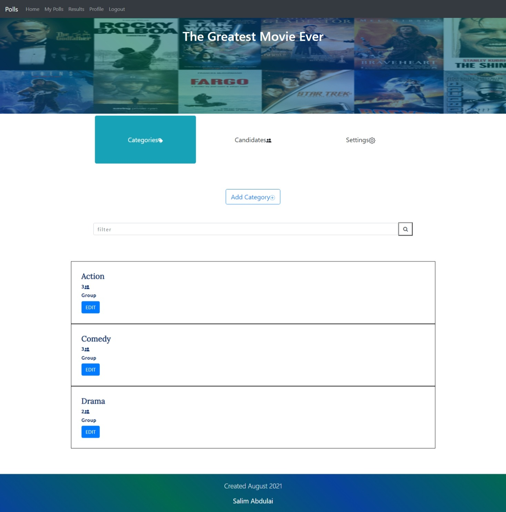
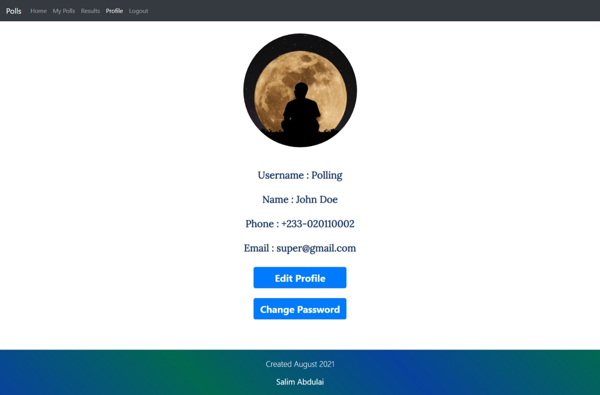
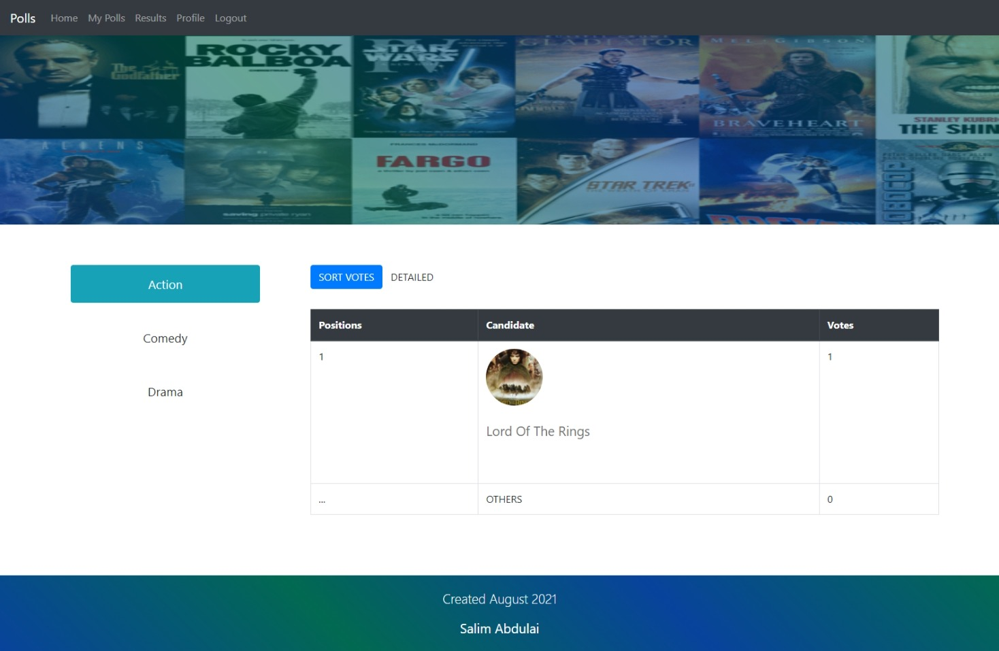
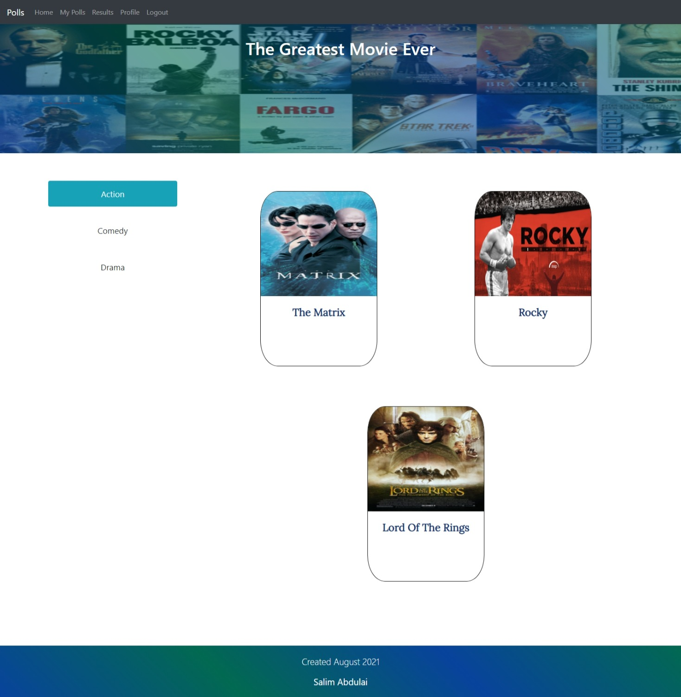
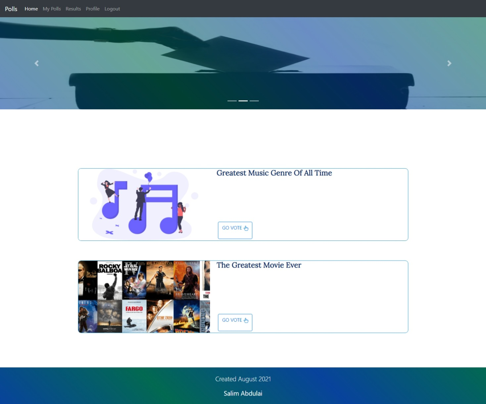
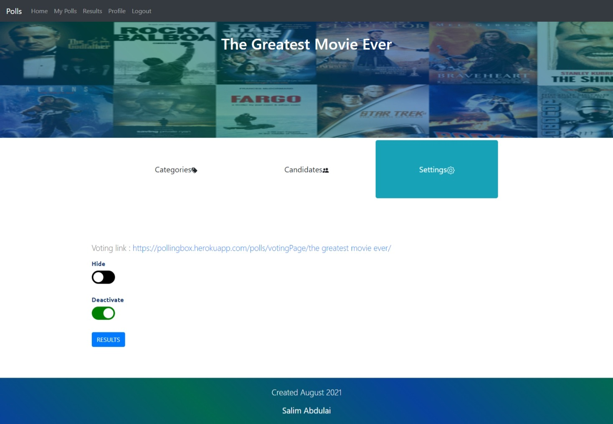
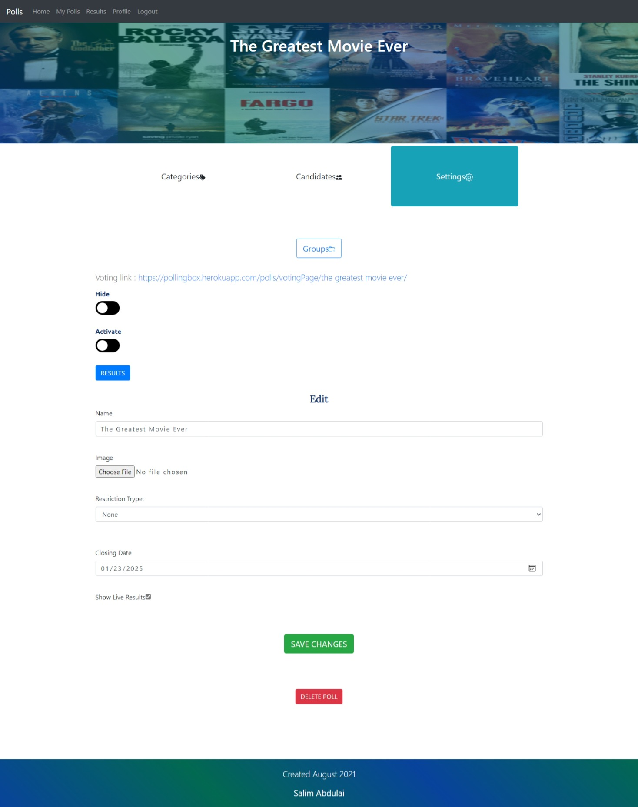
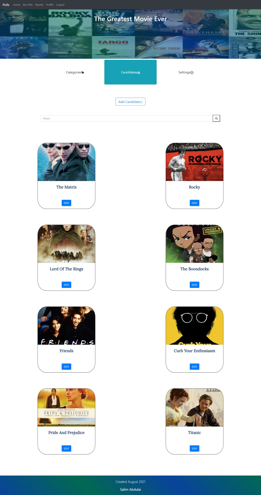

# Election app

> A CRUD app where users can create elections with different categories for other users to vote in.

## Test login
- Username: polling
- Password: polling

## Screenshots

## Built With
- Django
- React
- Javascript
- Html
- SCSS

## Other tools and technology
- Django unit tests
- Pandas
- Convert to excel
- Font awesome
- Bootstrap
- Heroku
- Cloudinary

## Video presentation
[Presentation](https://www.youtube.com/watch?v=nyNaelEiqxM)

## Live version
[heroku](https://pollingbox.herokuapp.com/)

## Features
1. Create and manage user account.
2. Create and manage poll.
3. Restrict poll ,access to vote, by key(s).
4. Vote on poll.
5. View results
6. Reset user password using email.
7. Send OTP message to mobile using twilio services or any other service
8. Reset password using email.
9. Add keys from excel sheet or export keys as excel sheet
10. Tests in apps

## How to run(Installation):
- Install project dependencies by running `pip install -r requirements.txt` .Dependencies include Django and Pillow module that allows Django to work with images. Wheel, pandas, numpy,scipy,openpyxl to run excel sheet read and write.
- Make and apply migrations by running `python manage.py makemigrations` and `python manage.py migrate`.
- Create superuser with `python manage.py createsuperuser` . This step is optional.
- Run server with `python manage.py runserver`
- Go to website address and register an account. Create a poll, manage your polls or vote on a poll

## Files and directories
- `Main Directory`.
    - `capstone` - Main application directory.
        - `gitignore` - Ignored files for git.
        - `.github` - Github actions, tests to run before commit.
        - `capstone` - Contains settings and main url file.
        - `media` - Contains all uploaded images to database
        -`static` - Holds all static files, jquery and bootstrap files and also static images.
            - `css` - Contains all craeted css styling for the webstyle in style.scss/style.css.
            - `dependencies` - Contains all bootstrap, react and jquery offline files(css and js).
            - `images` - Contains all static images.
        - `requirements.txt` - Contains all needed installs/packages to run the application.
        - `user` - Contains all functionality concerning user model creation, management and database settings
            - `templates` - Contains all templates(html) for user login, register, reset password, edit and activate pages.
            - `admin.py` - How user models appear in admin model management UI
            - `forms.py` - Contains UserForm, ChangePasswordForm and EditUserform which are used to create and edit user account details making sure provided inputs adhere to restraints such as password validity, input length validity.
            - `models.py` - Contains two classes User and ActivationCode which manage user database and creates activation codes for inactivate users respectively 
            - `tests.py` - Contains test to ensure smooth running of app, checking models , views and requests.
            - `urls.py` - Contains all urls path for user login, registration, reset password, edit and activate account.
            - `views.py` - Contains all view functions for  login, sign up, activate, generate otp, send messages, forget and reset password as well as logout.
        - `polls` - Contains all functionality concerning poll model creation, management and database settings
            - `static,polls,js` - Contains all React and Javascript files for DOM manipulation in voting page, settings page, results page
            - `templates` - Contains all templates(html) for general layout(theSP) and for poll(polls) 
            - `admin.py` - How poll models appear in admin model management UI
            - `forms.py` - Contains PollForm, CandidateForm EditPollForm and KeyForm which are used to create and edit poll, candidates and create keys, making sure input data adheres to restrainsts 
            - `models.py` - Contains six classes Poll, PollCategory, Candidate, PollCategoryGroup, RestrictionKey and Vote which manage poll database, , category database, candidate database, group database, restriction key database and votes database.
            - `tests.py` - Contains test to ensure smooth running of app, checking models , views and requests.
            - `urls.py` - Contains all urls path for viewing polls, managing polls and api requests
            - `views.py` - Contains all view functions for index, viewing and managing created polls, voting on polls, checking key if required, viewing results and restricting who can have access to the data
            
## Distinctiveness and Complexity:
- More than one app with models that have a more complex relation and influence each other.
- Uses React, ajax functionality, fetch data without reloading the page.
- Hide poll feature to avoid listing active poll in home index
- Can vote for one only candidate in a category, prevents double voting by same user
- Send password reset code using email.
- Upload keys from excel, and download keys as excel
- 4 digit OTP generation, to be sent via twilio messaging services
- Completely Mobile responsive.
- Various checks and restrictions are implemented on multiple models to ensure smooth running, such as on launching a poll, checks to - remove empty empty groups and categories, any votes before launch,etc
- Also unit tests have been introduced to make sure the apps run as intended. 
- Timeout if account inactive for 1800s, requiring logging in again

## Additional Info:
- Twilio service needs auth thus has been deactivated from sending messages, OTP is printed in the cmd terminal instead
- Email deactivated

## Author

👤 **Salim Abdulai**

- GitHub: [@RayhanTabase](https://github.com/RayhanTabase)
- Twitter: [@RayhanTabase](https://twitter.com/@RayhanTabase)
- LinkedIn: [Salim-Abdulai](https://linkedin.com/in/salim-abdulai-5430065b)
- Email: salimabdulai2@yahoo.com

## 🤝 Contributing

Contributions, issues, and feature requests are welcome!

Feel free to check the [issues page](../../issues/).

## Show your support

Give a ⭐️ if you like this project!

## 📝 License

This project is [MIT](./MIT.md) licensed.

